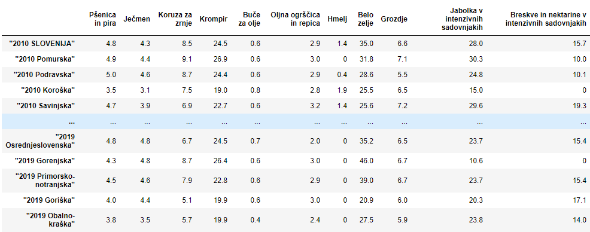
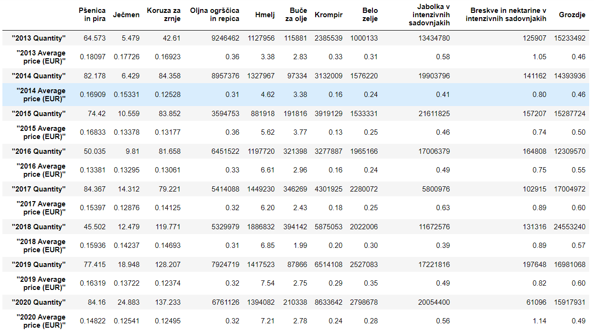
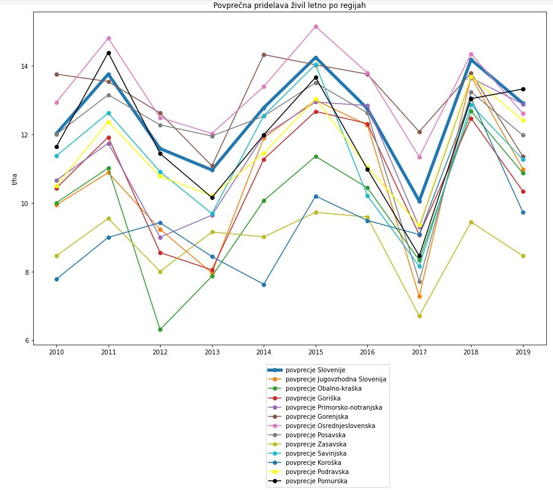
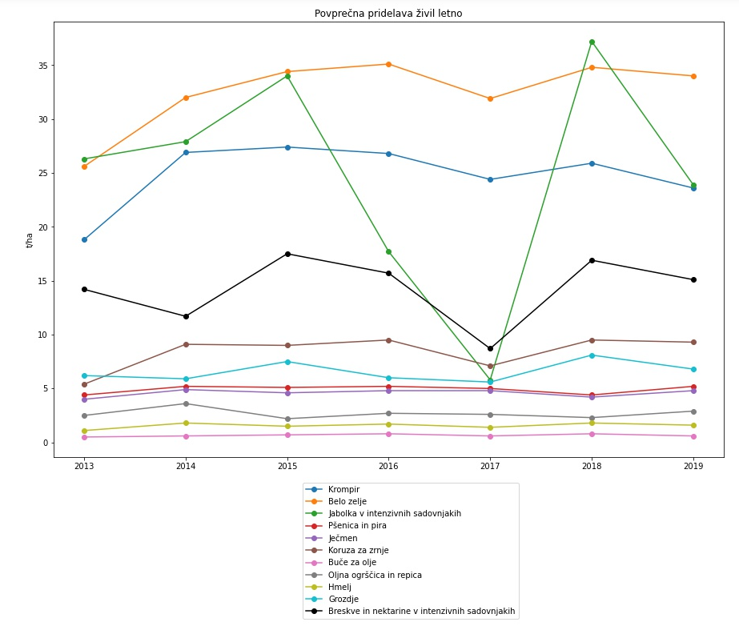
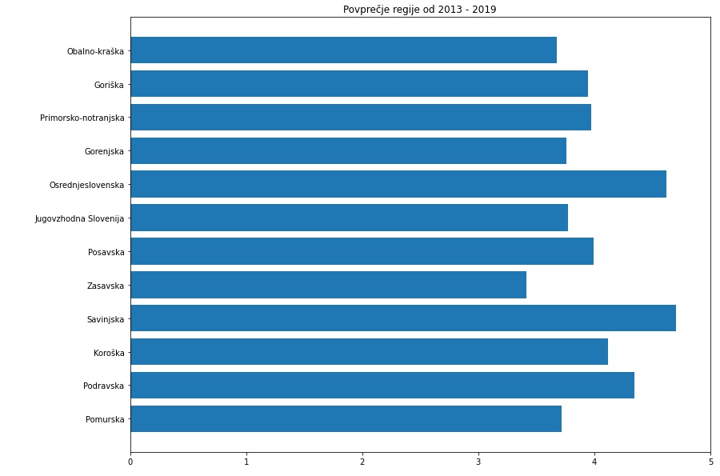
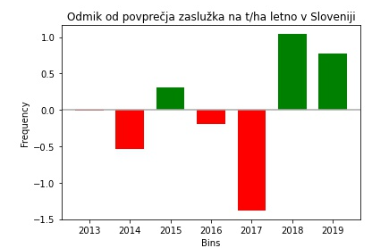

# Povprečni pridelek (t/ha) pomembnejših kmetijskih kultur
## Opis problema
Kmetje se vsako leto srečujejo s problemom, kaj za tisto leto posaditi, da se jim bo iz finančnega vidika najbolj izplačalo. Trenutno se tako ravnajo glede na ceno pridelkov iz prejšnjih let, po večini pa se ne ravnajo glede na kulturo, ki za določeno regijo da najboljši izkoristek. S seminarsko nalogo želimo kmetu omogočiti napoved pridelka, da ima za prihajajočo sezono dovolj skladiščnih kapacitet za določeno kulturo in, da na podlagi prejšnjih let izbere za sajenje najbolj profitabilno kulturo. S temi podatki lahko izogne nepotrebnim stroškom, prav tako pa lahko glede na tržne cene izbere kulturo, ki ima najboljše razmerje med tržno ceno in napovedano količino pridelka.
## Opis podatkov
Naši podatki so matrika statističnih regij in povprečni pridelek v enoti t/ha (regija/povprečni pridelek). Podatki segajo od leta 2010 do 2019. Imamo tudi matriko povprečnih odkupnih cen kmetijskih kultur (odkupna cena/leto) od leta 2013 do 2020 s katero si bo model pomagal pri iskanju napovedi razmerij med napovedano količino pridelka in napovedano ceno.

[Povprečni pridelek (t/ha) pomembnejših kmetijskih kultur, po statističnih regijah, Slovenija, letno - **SiStat** portal](https://pxweb.stat.si/SiStatData/pxweb/sl/Data/-/1502410S.px)
[Količine in povprečne cene odkupljenih kmetijskih pridelkov, Slovenija, letno - **OPSI** portal](https://podatki.gov.si/dataset/surs1505000s)

### Povprečni pridelek t/ha Pomembnejših kemtijjskih kultur
Podatke smo z uporabo dictReader-ja prebrali in jih zapakirali v Pandas-ov DataFrame (code-block 2 v Projekt.ipynb). Vrstice predstavljajo pridelek posameznega leta in regije, stolpci pa predstavljajo dejanski pridelek določene kmetijske kulture (ječmen, pšenica...). Imeli smo težave z branjem podatkov, saj niso zakodirani z utf-8, ampak smo to nekako razrešili.

### Količine in povprečne cene kmetijskih pridelekov t/ha Pomembnejših kemtijjskih kultur

Podatki so bili v formatu pc-axis in smo jih v csv pretvorili z uporabo programa px-win. Vrstice predstavljajo skupen donos in povprečno odkupno ceno za posamezna leta, stolpci pa predstavljajo posamezno kmetijsko kulturo. S prva je bilo teh kultur več, zato smo pobrisali tiste, ki jih ne najdemo v datoteki za povprečni pridelek t/ha Pomembnejših kemtijjskih kultur.(code-block 4 v Projekt.ipynb)

## Pomembnejša vprašanja
Na podlagi podatkov lahko pridobimo odgovore na naslednja vprašanja: 
 * najbolj profitabilne regije
 * gibanje doprinosa kultur skozi čas (recimo  črtni grafikon doprinosa v odvisnosti od časa kjer posamezno linijo predstavlja določena kultura)
 * najbolj profitabilne kulture v Sloveniji
 * najbolj primerna območja za sajenje določene kulture
 * napoved doprinosa glede na kulturo, regijo in leto
 * napoved najbolj primerne kulture glede na regijo in leto
 * gibanje odkupnih cen kultur skozi leta
 * napovedovanje odkupnih cen kultur

## Izvedena analiza in glavne ugotovitve
S prva smo analizirali povprečen pridelek na regijo skozi leta. Za to vizualizacijo smo izračunali povprečje vseh kultur v vsaki regiji skozi leta. Iz grafa je razvidno, da smo leta 2013 in 2017 zabeležili največji padez pridelave v večini regij.

## Gibanje doprinosa kultur skozi čas
Pri naslednji analizi smo ugotavljali Povprečno pridelavo kultur skozi leta. Za to vizualizacijo smo prikazali koliko je bilo za celotno slvoenijo pridelka posamezne kulture letno. 

## Najbolj profitabilne regije
Za tretjo analizo smo pogledali katera regija je najbolj profitabilna oz. kateri so zaslužili največ na t/ha. Iz grafa je razvidno, da sta Savinjska in Osrednjeslovenska regija najbolj profitabilni.

Za zadnjo analizo smo gledali odmik od povprečja zaslužka na t/ha letno v Sloveniji. Iz grafa smo razbrali, da so bili leta 2014 in 2017 so se zalužki najbolj zamnjšali.

## Zanimive ugotovitve

Ker smo videli, da je pridelek 2013 in 2017 najbolj padel smo po internetu raziskovali, kaj bi lahko bil razlog za takšen upad. Ugotovili smo, da je bila leta 2013 in 2017 suša, kar je razlog za padec v pridelavi vseh kultur. O tem priča tudi članek Dr. Andreja Sušnika in Dr. Gregorja Gregorčiča, ki ga lahko najdemo [na tej povezavi](http://mvd20.com/LETO2017/R5.pdf).
